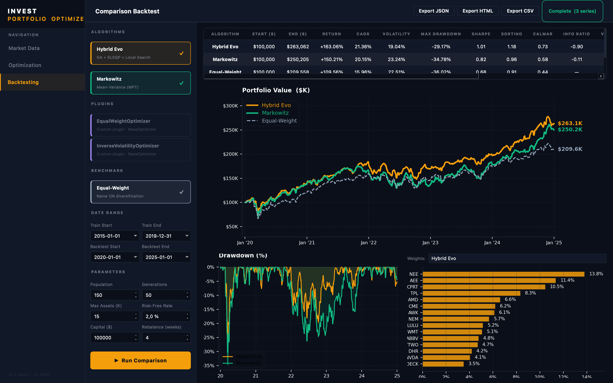

# InvestPortfolio Optimizer

Настільний застосунок для автоматизованої оптимізації інвестиційного портфеля акцій S&P 500. Поєднує **гібридний еволюційний алгоритм**, агента **навчання з підкріпленням (PPO)** та класичні мейн-варіанс методи. Має сучасний інтерфейс на PySide6, локальну SQLite-БД та вбудований бектестинговий двигун.



---

## Можливості

- **Гібридний еволюційний оптимізатор** — генетичний алгоритм + градієнтне уточнення + SLSQP-поліровка ваг портфеля.
- **PPO-агент (Reinforcement Learning)** — тренування на історичних даних через `stable-baselines3` та власне середовище Gymnasium.
- **Класична оптимізація Марковіца** — через бібліотеку PyPortfolioOpt.
- **Плагінна архітектура** — легке додавання користувацьких алгоритмів через `BaseOptimizer`.
- **Бектестинговий двигун** — періодичне ребалансування, метрики Total Return, CAGR, Volatility, Max Drawdown, Sharpe, Sortino.
- **Дані S&P 500** — автоматичне завантаження 30 років тижневих котирувань з Yahoo Finance у локальну SQLite-БД.
- **GUI на PySide6** — темна тема, асинхронні фонові операції, інтерактивні графіки (Matplotlib).

---

## Архітектура

Шаруватий моноліт із паттерном **Facade**:

```
┌──────────────────────────────────────────────────┐
│                  Шар інтерфейсу                  │
│         (PySide6 MainWindow + LoadingWindow)     │
├──────────────────────────────────────────────────┤
│                  Фасадний шар                    │
│                  (PortfolioCore)                 │
│  ┌──────────┬──────────┬────────────┬──────────┐ │
│  │ Гібрид.  │   PPO /  │  Бектестинг│ Плагіни  │ │
│  │   Evo    │    RL    │            │          │ │
│  └──────────┴──────────┴────────────┴──────────┘ │
├──────────────────────────────────────────────────┤
│                   Шар даних                      │
│   (PortfolioRepository + DataEngine + SQLite)    │
└──────────────────────────────────────────────────┘
```

`PortfolioCore` — єдина точка доступу до всіх підсистем. Важкі залежності (`stable-baselines3`, TensorFlow) підвантажуються лінько, тому фасад залишається імпортовним без AI-пакетів. Усі тривалі операції виконуються у `QThread`-воркерах.

---

## Структура проєкту

```
.
├── README.md                    # Цей файл
├── requirements.txt             # Базові залежності
├── requirements-ai.txt          # Додаткові залежності для PPO
├── run_test.sh                  # Скрипт запуску тестів
├── resources/db/portfolio.db    # SQLite-БД (створюється автоматично)
├── models/ppo_portfolio/        # Збережені PPO-моделі
└── app/
    ├── main.py                  # Точка входу GUI
    ├── train_ppo.py             # Скрипт тренування PPO
    ├── run_downloader.py        # Ручне заповнення БД
    ├── core/                    # Фасад PortfolioCore
    ├── algorithms/              # Гібридний еволюційний оптимізатор
    ├── ai/                      # PPO: середовище, тренер, інференс
    ├── backtesting/             # Бектестинговий двигун
    ├── data/                    # ORM, репозиторій, завантажувач даних
    ├── plugins/                 # Користувацькі алгоритми
    ├── ui/                      # PySide6: вікна, віджети, воркери
    └── tests/
        ├── component/           # Компонентні тести
        ├── integration/         # Інтеграційні тести
        └── test_rebalancing.py  # Тести ребалансування
```

---

## Встановлення

### Передумови

- **Python 3.11** (рекомендовано — для сумісності PySide6 з matplotlib).
- macOS / Linux / Windows.
- Віртуальне середовище.

### Кроки

```bash
# 1. Перейти в каталог проєкту
cd path/to/Diploma

# 2. Створити та активувати venv
python3.11 -m venv venv
source venv/bin/activate          # macOS / Linux
# venv\Scripts\activate            # Windows

# 3. Встановити базові залежності
pip install -r requirements.txt

# 4. (Опційно) Встановити залежності для PPO
pip install -r requirements-ai.txt
```

> `requirements-ai.txt` через директиву `-r requirements.txt` автоматично підтягує базові пакети — для повного встановлення достатньо однієї команди.

---

## Запуск

### Графічний інтерфейс

```bash
python app/main.py
```

При першому запуску застосунок автоматично завантажить історичні дані S&P 500 у `resources/db/portfolio.db` (займає кілька хвилин).

### Ручне завантаження даних

```bash
python app/run_downloader.py
```

### Тренування PPO-агента

```bash
# Через фасад (рекомендовано)
python app/train_ppo.py

# Прямий API
python app/train_ppo.py --mode direct

# Швидкий тестовий прогін
python app/train_ppo.py --timesteps 50000
```

Основні параметри:

| Параметр | Опис | За замовчуванням |
|---|---|---|
| `--start DATE` | Початок тренувальних даних | `2010-01-01` |
| `--train-end DATE` | Кінець тренування / початок бектесту | `2020-01-01` |
| `--end DATE` | Кінець бектесту | `2024-01-01` |
| `--timesteps INT` | Кроків PPO | `500000` |
| `--max-assets INT` | Максимум активів у середовищі | `50` |
| `--top-n INT` | Топ-N активів у фінальному портфелі | `15` |
| `--no-curriculum` | Вимкнути curriculum learning | — |
| `--seed INT` | Сід ГПЧ | `42` |
| `--plot` | Зберегти графіки в `reports/` | — |
| `--save` | Зберегти експеримент у БД | — |


## Тестування

```bash
# Усі тести
pytest app/tests/ -v

# Окремі групи
pytest app/tests/component   -v
pytest app/tests/integration -v
pytest app/tests/test_rebalancing.py -v
```

---

## Ключові концепції

- **Penalised Sharpe Ratio** — цільова функція з штрафами за порушення обмежень: `Sharpe − λ₁·|Σw−1| − λ₂·max(0, Σb−K) − λ₃·Σmax(0,−w)`.
- **Обмеження кардинальності (K)** — максимальна кількість активів у портфелі (за замовчуванням 15).
- **EWMA + Ledoit-Wolf shrinkage** — стійкі оцінки очікуваних дохідностей та коваріаційної матриці.
- **Variance thermostat** — адаптивне підвищення мутації при стагнації популяції.
- **Curriculum learning (PPO)** — спочатку тренування на випадковому підвікні даних, потім на повному датасеті.
- **Періодичне ребалансування** — тижневе / місячне / квартальне / buy-and-hold.

---

## Розширення

### Додати плагін-оптимізатор

1. Створити `.py`-файл у `app/plugins/`.
2. Успадкувати клас від `BaseOptimizer`, реалізувати:
   ```python
   def optimize(self, prices_df, config_dict) -> Dict[str, float]: ...
   ```
3. `PluginManager` знайде клас автоматично. Виклик через
   `PortfolioCore.run_plugin_optimization("ClassName", ...)`.

Приклад — `app/plugins/inverse_volatility.py`.

### Додати UI-сторінку

1. Створити віджет у `app/ui/widget/`.
2. Зареєструвати його у `main_window.py` через `QStackedWidget`.
3. Для фонових операцій додати `QThread`-воркер у `app/ui/workers.py`.

---

## Технології

| Категорія | Бібліотека |
|---|---|
| Мова | Python 3.11 |
| GUI | PySide6 (Qt 6) |
| RL | stable-baselines3, Gymnasium |
| Оптимізація | Власний GA + SciPy SLSQP |
| Портфельна математика | PyPortfolioOpt |
| База даних | SQLite + SQLAlchemy 2.0 |
| Дані | yfinance (Yahoo Finance) |
| Графіки | Matplotlib |
| Обчислення | NumPy, Pandas, SciPy, Numba |
| Тестування | pytest |

---


